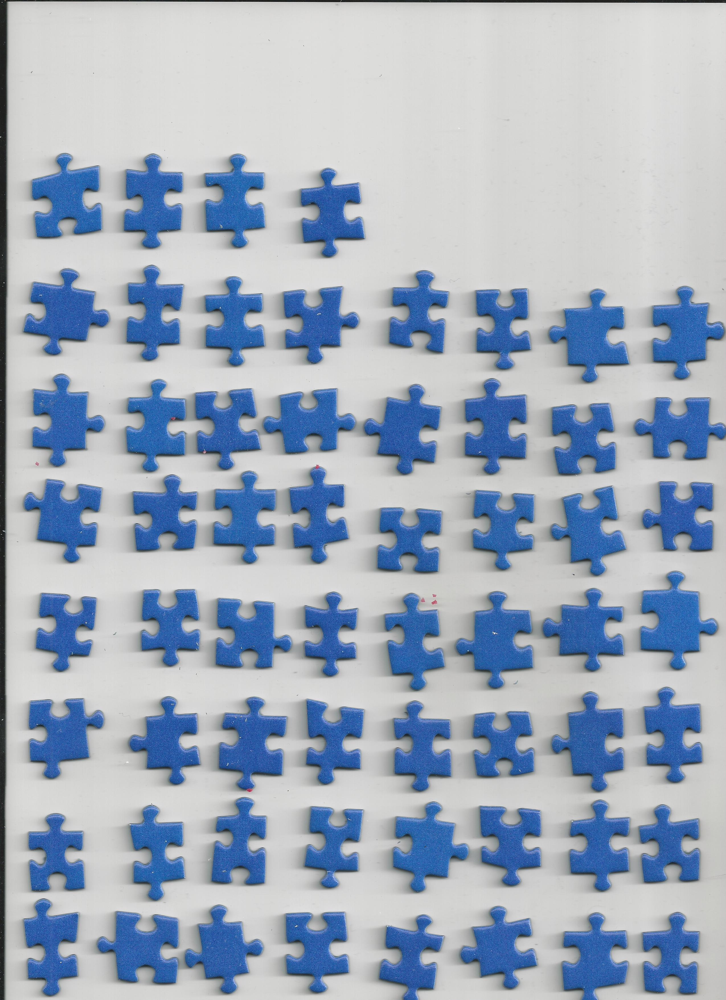
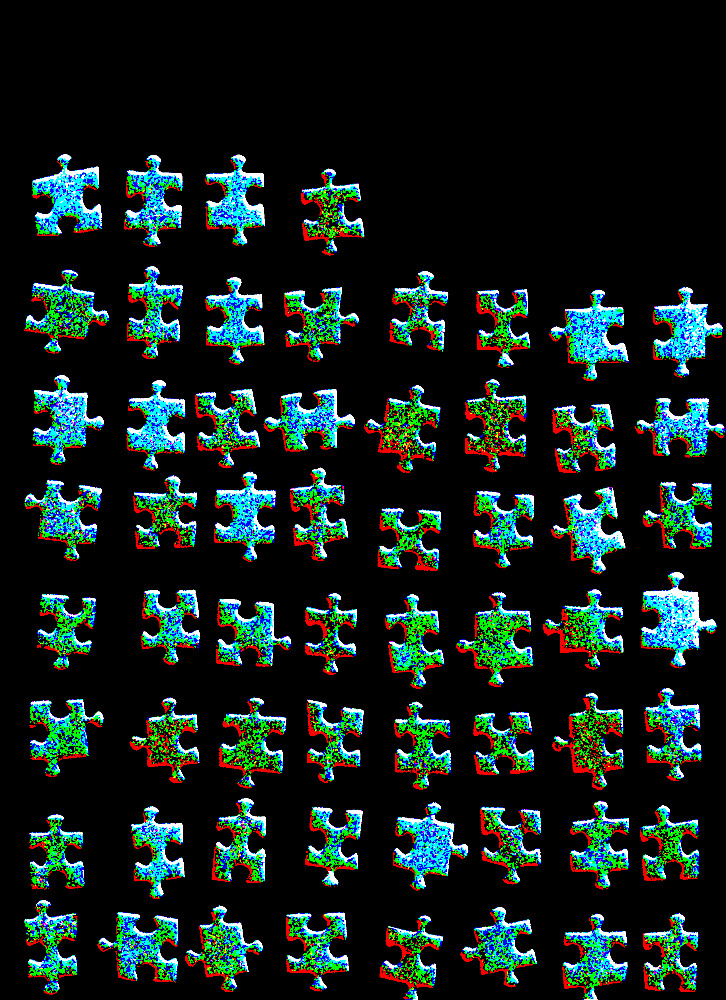
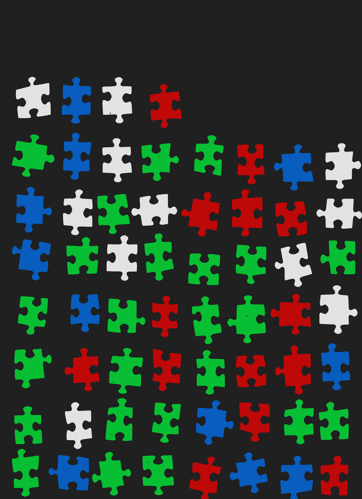

# PuzzleSkyPieces

Puzzles with large areas of sky can be demanding. This small script is intended to assist you by
 separating single pieces according to their blue-color gradient. Details are shown below.
 
### Requirements:
* [Pillow-8.1.0](https://pypi.org/project/Pillow/) Required for image processing

### Input:
A .jpg file (or any other file type supported by Pillow) that contains a scan of blue puzzle pieces.
Each piece should have some margin to its neighbors to obtain better results.

### Output:
A .png file (or any other file type supported by Pillow) that contains recolored puzzle pieces. Colors are
assigned such that red represents the 25% of the darkest pixels/pieces. Ne next 25% are interpret as green.
Light pixels/pieces are indicated blue, whereby the lightest 25% are shown white. Note that those thresholds
can be adjusted in the code.

### Execution modes:
There exist two different execution modes:  

Mode   | Description
-------|------------
PIXEL  | Consider each pixel widely independent, i.e. the upper mentioned threshold are applied to single pixels.
PIECE  | Puzzle pieces are fully recolored by a majority voting process, i.e. the upper threshold are applied on full pieces

### Example Images:

### Note:
* This script comes without any warranty
* Have fun with it